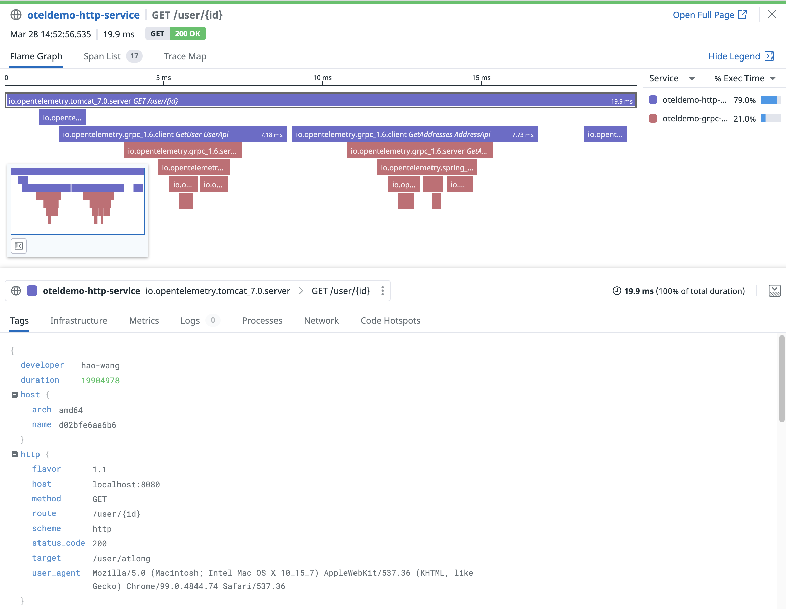

OpenTelemetry Demo
---

### Get started

#### Set up *Datadog API Key*
* Open [Datadog API Keys](https://app.datadoghq.com/organization-settings/api-keys)
* Copy the key "Non-Production"
* Paste to `exporters.datadog/api.api.key` in [otel/otelcol-contrib-config.yaml](otel/otelcol-contrib-config.yaml)

#### Start
```shell
./gradlew clean build
./script/build
docker-compose up
```
Open [http://localhost:8080/user/foo](http://localhost:8080/user/foo)

#### View traces in Datadog
* Open services
  * [oteldemo-http-service](https://app.datadoghq.com/apm/service/oteldemo-http-service?env=dev)
  * [oteldemo-grpc-service](https://app.datadoghq.com/apm/service/oteldemo-grpc-service?env=dev)
* View traces
  * [trace example](https://app.datadoghq.com/apm/traces?query=env%3Adev%20AND%20service%3Aoteldemo-http-service%20AND%20operation_name%3Aio.opentelemetry.tomcat_7.0.server&cols=core_service%2Ccore_resource_name%2Clog_duration%2Clog_http.method%2Clog_http.status_code&historicalData=true&messageDisplay=inline&showAllSpans=true&sort=desc&spanID=9342064594984725429&streamTraces=true&timeHint=1648450376555&trace=AgAAAX_PTJNrjCxvVQAAAAAAAAAYAAAAAEFYX1BUTUtlQUFBQklBYzRJdXhqVHNRSgAAACQAAAAAMDE3ZmNmNTEtNTJjNi00NjZlLTg4ZTgtYTY3YzdiYzVmNzg4&traceID=703803619313151353&start=1648447860000&end=1648451460000&paused=true)
    

### TODO
* opentelemetry API
  * Trace, @WithSpan
  * Meters
  * Logs